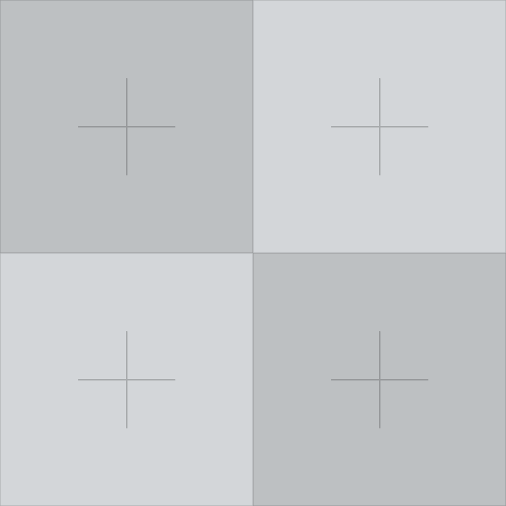
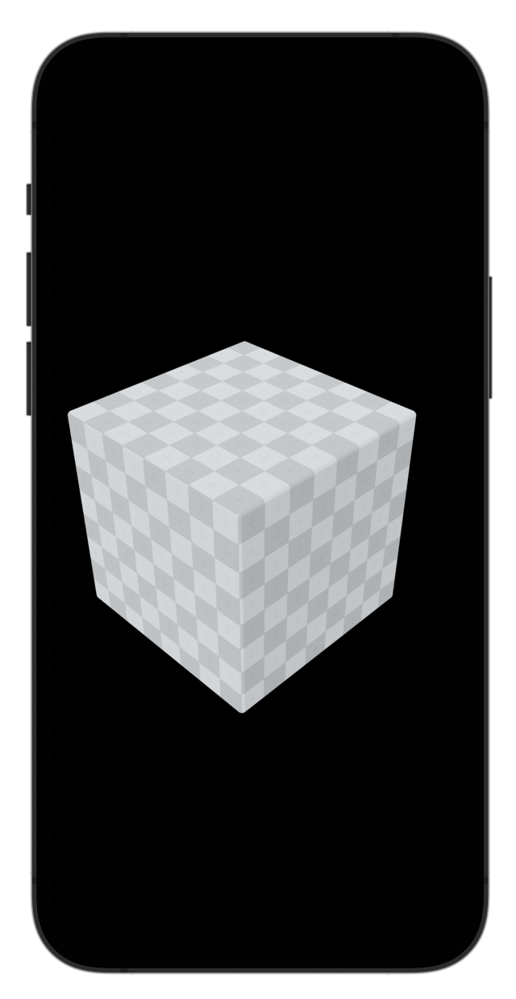
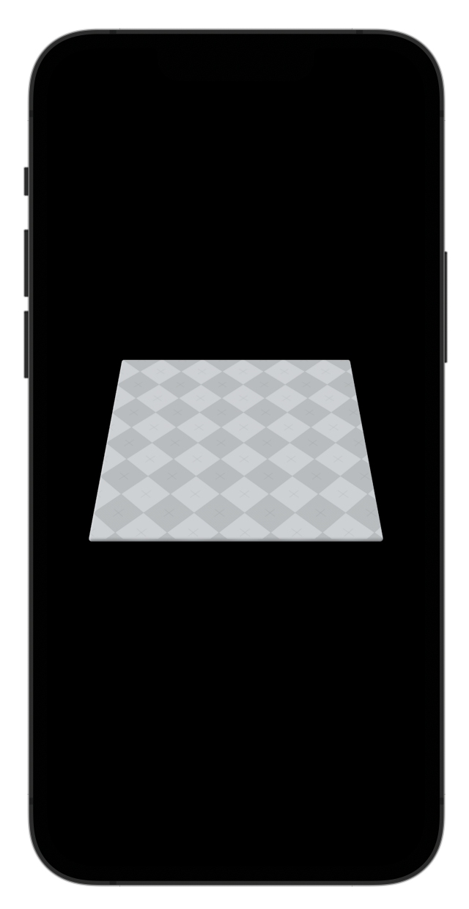

## Texture Tiling

*7 Feb 2026*

How can we tile a texture on mesh surface in RealityKit? We can use the `textureCoordinateTransform.scale` property of a PBR material:

```swift
var material = PhysicallyBasedMaterial()

/// Create a texture resource from an image in Xcode Assets
if let texture = try? TextureResource.load(named: "tile_texture") {
    material.baseColor.texture = .init(texture)
    /// Tile the texture
    material.textureCoordinateTransform.scale = SIMD2<Float>(x: 4, y: 4) /// Tile 4x4
}
```

Texture:



Tiling 4x4:



We can apply other interesting transforms to the texture such as rotation:

```swift
material.textureCoordinateTransform.rotation = .pi/4
```

