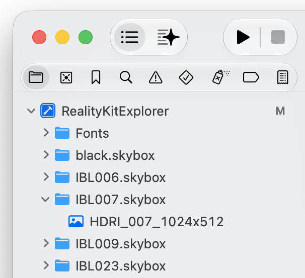

# Light & Shadow

*22 Dec 2025*

## Environment Lighting

By default, `ARView` and `RealityView` apply image-based lighting (IBL), commonly known as HDRI or skybox. In `RealityRenderer`, no default lighting is applied. Non emissive materials will appear flat black unless a light source is added.

https://github.com/user-attachments/assets/012630a2-2d0a-46ac-a108-d59b4612988e

<video src="../Media/RealityKit-IBL-Toggle.mov" width="33%" controls=""></video>

In order to unify the environment lighting across all RealityKit renderers, we can use `ImageBasedLightComponent` and `ImageBasedLightReceiverComponent`. The first component holds the image. The second component specifies which entity tree is lit by the image.

Below is code where a same root entity holds both components, therefore lighting all its descendants:

```swift
func setupIBL(holder: Entity, receiver: Entity) {
    Task {
        do {
            let iblResource = try await EnvironmentResource(named: "IBL007")
            var iblComponent = ImageBasedLightComponent(source: .single(iblResource))
            /// Whether the IBL inherit the rotation of the Entity
            iblComponent.inheritsRotation = true
            holder.components.set(iblComponent)
            receiver.components.set(ImageBasedLightReceiverComponent(imageBasedLight: holder))
        } catch {
            print(error)
        }
    }
}
```

```swift
RealityView { content in
    let anchor = AnchorEntity()
    content.add(anchor)

    setupIBL(holder: anchor, receiver: anchor)
}
```

`ARView` also have an environment property which we can use to specify IBL for that specific view:

```swift
class MyARView: ARView {
    
    required init(frame: CGRect) {
        super.init(frame: frame)
        
        Task {
            do {
                let environmentResource = try await EnvironmentResource(named: "black")
                /// ARView `environment` property
                environment.lighting.resource = environmentResource
            } catch {
                print("Could not load environment resource: \(error)")
            }
        }
        
    }
    
    required init?(coder: NSCoder) {
        fatalError("init(coder:) has not been implemented")
    }
    
}
```


## Environment Resource

What is "IBL007"? It's the name of the HDRI image used in this example, from [Leonid Altman](https://leonidaltman.gumroad.com/l/26-Free-Studio-HDRI-Maps)'s free pack. In order to create IBL resources for Xcode, follow the [excellent Twitter thread](https://x.com/AtarayoSD/status/1838133380455727451) by Yasuhito Nagatomo, and see the [documentation](https://developer.apple.com/documentation/realitykit/environmentresource):

> To add an environment resource to your Xcode project, make a folder with a name that ends in `.skybox` and place a single image inside. Ensure that the image is an environment map of equirectangular projection, also known as a *latitude-longitude projection*. Drag the folder into the Project navigator. In the options pane, choose to create a folder reference (not a group), and add the folder to your app’s targets. At build time, Xcode compiles the image for use as an environment resource and inserts the result into the app bundle.
>
> RealityKit supports the same input formats as Image I/O, such as `.png` and `.jpg` However, to achieve rich, vibrant lighting, use a `.exr` or `.hdr` format, which support a wide dynamic range.

Xcode project navigator would look like this:



If I want to remove the environment lighting entirely, I use a full black image as EnvironmentResource.

## Dynamic Lights

You can light a scene by adding a light component to an entity:

```swift
let lightEntity = Entity()
/// Choose from the available lighting components
let directionalLight = DirectionalLightComponent(
    color: .white,
    intensity: 1000
)
/// Position the light accordingly
lightEntity.look(at: [0, 0, 0], from: [3, 5, -2], relativeTo: nil)
lightEntity.components.set(directionalLight)
anchor.addChild(lightEntity)
```

## Shadows

If you want the light source to cast shadows, add the corresponding shadow component to it:

```swift
let shadowComponent = DirectionalLightComponent.Shadow()
lightEntity.components.set(shadowComponent)
```

If you want to opt out an entity from casting shadows, use the `DynamicLightShadowComponent`:

```swift
let entityDoesNotCastShadow = Entity()
entityDoesNotCastShadow.components.set(DynamicLightShadowComponent(castsShadow: false))
```

If you want to improve the quality of the shadows, use the `maximumDistance` parameter of the shadow component. For example:

```swift
let shadowComponent = DirectionalLightComponent.Shadow(maximumDistance: 5)
```

A maximum distance of 5 means no shadow will be rendered if the camera is farther than 5 meters from the expected shadows. The greater that value is, the poorer the shadow quality is. A maximum distance of 50m will draw shadows that are 50 meters away, but shadows that 1 or 2 meters away from the camera will have a poor quality. If you restrict the distance to 2 meters, the shadow will be much better, but no shadows will be drawn for distant objects.

A trick I use is to update the maximum distance according to the camera distance. Inside update:

```swift
let camera = // get the camera entity
let light = // get the light entity

let shadow = DirectionalLightComponent.Shadow(maximumDistance: camera.position.y)
light.components.set(shadow)
```

The code above would work well for a top down camera, in a scene where all content

## Links

- Complete [this question on StackOverflow](https://stackoverflow.com/questions/77930684/realitykit-incorrect-shadows-with-directional-light).