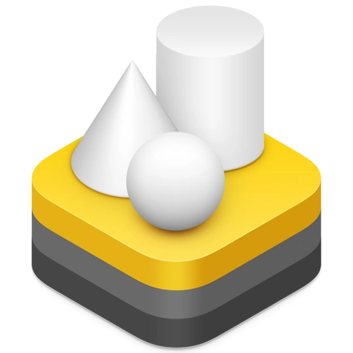

# Learning RealityKit

- [TextComponent Bug](Articles/textcomponent-bug.md), 3 Aug 2026
- [Physics Scales](Articles/physics-scales.md), 7 Mar 2026
- [Contact Events](Articles/contact-events.md), 13 Feb 2026
- [Scene Type](Articles/realitykit-types.md), 9 Feb 2026
- [Documentation Errors](Articles/documentation-errors.md), 7 Feb 2026
- [Texture Tiling](Articles/texture-tiling.md), 7 Feb 2026
- [Scene Instances](Articles/scene-instances.md), 4 Feb 2026
- [FOV Orientation & Hit Detection](Articles/fov-orientation-and-hit-detection.md), 1 Feb 2026
- [Physics Speed](Articles/physics-speed.md), 29 Dec 2025
- [Systems](Articles/systems.md), 23 Dec 2025
- [Light & Shadow](Articles/light-and-shadow.md), 22 Dec 2025
- [Gravity](Articles/gravity.md), 4 Oct 2025

## Code Samples

External code samples I found useful for my RealityKit projects:

- Apple, [RealityView Post Process](https://developer.apple.com/forums/thread/806524), 2025
- Apple, [Offscreen Render](https://developer.apple.com/forums/thread/762238?answerId=801164022#801164022), 2025

## Links

Interesting external resources:

- [Dennis Ippel](https://rozengain.medium.com/)'s blog
- Thomas Kumlehn, [Apple AR Quick Look / RealityOS](https://configxr.kreativekk.de/#/about/apple-ar-quick-look---realityos)
- [Andy Jazz](https://medium.com/@arkit) Medium Blog and StackOverflow contributions

---

This page is not affiliated with Apple. The RealityKit logo is a property of Apple. Document started *27 Sep 2025*.